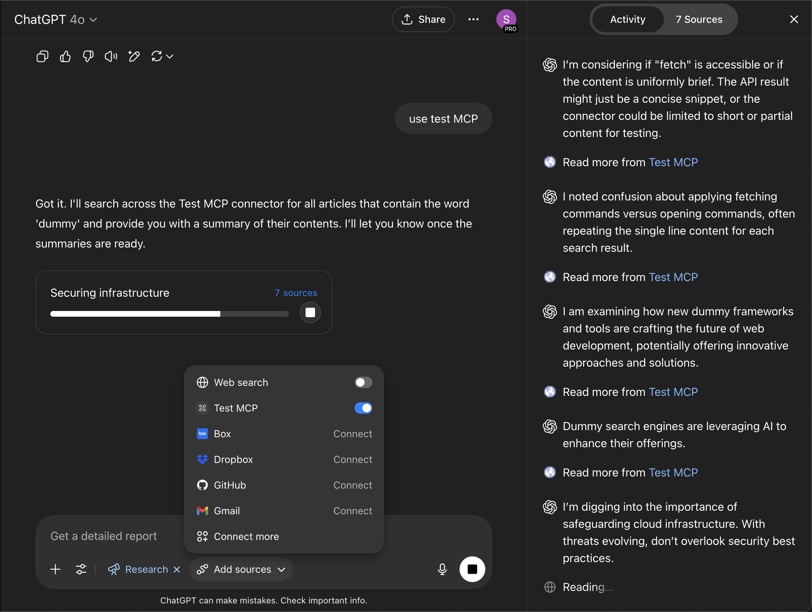

# ChatGPT Deep Research Connector Example

This project is an example implementation of a [ChatGPT Deep Research Connector](https://platform.openai.com/docs/mcp), demonstrates how custom data sources, like internal sales lists or financial documents, could be integrated into ChatGPT Deep Research.

This project currently implements two functions: `search` and `fetch`. Some internal OpenAI connectors may offer more functionalities, but custom connectors are currently limited to these two operations. 

Below is an example of what Deep Research with a Custom Connector looks like:



## Features

- Implements `search` and `fetch` for the ChatGPT Deep Research Connector.
- Uses [Auth.js (formerly NextAuth.js v5)](https://authjs.dev) for authentication.
- Incorporates `@node-oauth/oauth2-server` for OAuth 2.0 server functionality.
- Includes custom server-side authentication logic for dynamic client registration.

## Important Considerations

- **OAuth Implementation**: This project utilizes a custom OAuth setup due to various issues with the standard MCP OAuth server implementation. 
- **Production Use**: The custom authentication code has not been extensively vetted. **Use this project in a production environment at your own risk.** Thorough review and testing are strongly advised.
- **ChatGPT Connector UI**: Be aware of potential bugs in the ChatGPT UI when adding custom connectors. After adding a connector, you might be redirected to a callback URL (e.g., `https://chatgpt.com/backend-api/aip/connectors/links/oauth/callback?...`) and experience a hang for approximately 30 seconds. You may have to go through the add connector flow once or twice before the connector functions correctly. Additionally, ChatGPT might display an error message stating, "This MCP server doesn't implement our specification." This is a known issue with the current ChatGPT connector interface and can typically be ignored if the connector otherwise functions as expected.
- **Feature Availability**: Custom Connectors are not available on ChatGPT free or Plus plans, or in EEA, Switzerland, and the UK.

## Usage

This sample app uses the [Vercel MCP Adapter](https://www.npmjs.com/package/@vercel/mcp-adapter) that allows you to drop in an MCP server on a group of routes in any Next.js project.

Update `app/api/[transport]/route.ts` with your tools, prompts, and resources following the [MCP TypeScript SDK documentation](https://github.com/modelcontextprotocol/typescript-sdk/tree/main?tab=readme-ov-file#server).

## Notes for running on Vercel

- To use the SSE transport, requires a Redis attached to the project under `process.env.REDIS_URL`
- Make sure you have [Fluid compute](https://vercel.com/docs/functions/fluid-compute) enabled for efficient execution.
- After enabling Fluid compute, open `app/route.ts` and adjust `maxDuration` to 800 if you are using a Vercel Pro or Enterprise account.
- You can adapt this project from the [Next.js MCP template](https://vercel.com/templates/next.js/model-context-protocol-mcp-with-next-js).

## Environment Variables Setup

Create a `.env` file in the root of the project and add the following environment variables. You can use the `.env.example` file as a template.

```
REDIS_URL=

AUTH_SECRET=

AUTH_GITHUB_ID=
AUTH_GITHUB_SECRET=

AUTH_GOOGLE_ID=
AUTH_GOOGLE_SECRET=

DATABASE_URL=
```

**Recommendations**:
- For a managed PostgreSQL instance (`DATABASE_URL`), consider [Supabase](https://supabase.com).
- For Redis hosting (`REDIS_URL`), consider [Vercel KV](https://vercel.com/storage/kv) or [Upstash](https://upstash.com).

Locally, use Docker to start Redis quickly:
```sh
docker-compose up -d
```

## Running a Test Client

To test your MCP server locally, you can use the Model Context Protocol Inspector. Run the following command in your terminal:

```sh
npm run inspector
```

This will start the inspector tool. To connect to your local server, use the endpoint `http://localhost:3000/api/sse` in the inspector. This allows you to send requests to your local MCP server endpoints.

You can remove the OAuth authentication code from `app/api/[transport]/route.ts` if you want to try the MCP in OpenAI's playground, but playground currently doesn't support OAuth authentication for MCPs. https://platform.openai.com/playground/prompts. Alternatively, grab your bearer token from devtools after a successful OAuth flow and use that in the Authorization header of the OpenAI playground.


## How to add Custom Connector to ChatGPT

1. Open ChatGPT.
2. Click "Tools" under the input field.
3. Select "Run Deep Research".
4. Choose "Add Sources" and click "Connect More".
5. Click "Create" next to "Browse Connectors".
6. Fill out the connector's details: provide name, description, and MCP Server URL (from your Vercel deployment or locally via ngrok/tailscale).
7. Select "OAuth Authentication", toggle "I trust this application", and click "Create".
8. Complete the OAuth flow to integrate the connector into your ChatGPT environment.